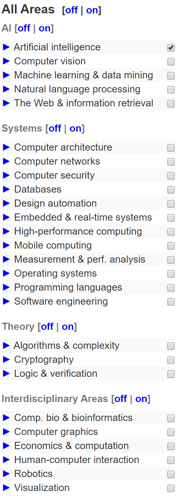
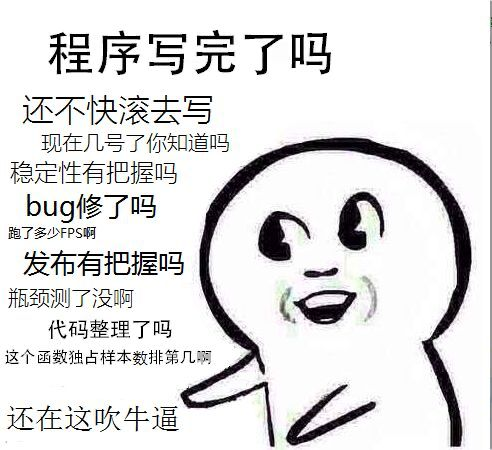
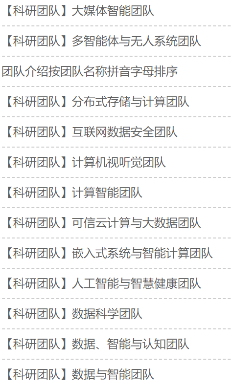

# Overview of Computer Science

有的同学表示对计算机有什么方向比较迷茫。应一些小伙伴要求，我就班门弄斧得给大家稍微介绍和总结一下。

## 专业计算机科研领域榜单-CSRankings

首先你需要查看一个计算机学科排名的榜单，叫做[CSRankings](http://csrankings.org/)。这个榜单较为全面的展示了计算机学科的各个方向和排名。

虽然CSRankings有很多大学的信息并不完全，也因此被诟病，但是CSRankings是一个**专门给大学的计算机学科排名的榜单**。而且CSRankings的考量因素并不包括其他榜单考虑的很多较为难以量化和主观的因素，只考虑从一定角度来说，CSRankings做到了完全靠数据说话，完全客观。

感兴趣的同学可以看看电子科技大学在计算机领域的综合排名和各个细分方向排名是多少。

左边就是计算机的各个领域和细分方向了。

同学们就可以看看哪个方向你看上去比较感兴趣，然后**Google Scholar(谷歌学术)或者wiki(维基百科)**搜索一下，最好不要用中文搜索。因为在科研领域中，中文是没有地位的，资料非常不完善并且可能搜出来的东西完全是错的或者是歧义。

这里稍微歪下，稍微介绍下**Google Scholar**，它是谷歌的一个学术搜索引擎，也是最常用的学术资料搜索引擎，无论是搜索论文还是搜索机构，大学，教授都很方便，电子科技大学现在校园网已经可以不用翻墙就可以访问谷歌学术了。

## 计算机工程

细心的同学会注意到“计算机科学与技术”专业代表了两个方向，即“科学”与“技术”。

那么我们大概了解了“科学”的方向都有了什么之后，就该了解一下工程界的计算机大概的方向了，也就是“技术”的部分。

我们知道构建一个app一般需要一个美观的界面，那么构建界面和UI的就是**前端**。

app只有界面不行，还得有功能，功能就需要有服务器和数据库等等的支持，负责这一部分的统称为**后端**。

软件写出来直接运行可能会有bug，如果直接发布可能会有严重的后果，负责写程序对软件进行各项检查的就是**测试**。

下面这个表情包就大概能体现一个软件测试的各项工作了。

当然软件也需要专业的安全保障，对软件进行安全测试就是**安全**部门的工作了，传统的安全防护有对软件进行逆向工程（俗称“破解”）方面的保护，最近比较火的是网络安全，阻拦网络上的各种恶意攻击和病毒。

当然也会有一些人是负责总体设计的，他们一般被叫做**架构师**。

实际上构建一个app可能会很复杂，上面的分法是很粗糙的，不同的软件公司和不同的软件都会有不同的开发团队组成。

有些比较赶新潮的公司就会有云技术，AI，大数据等部门。

这上面是说构建一个app，当然也存在构建一些所谓“基础设施”的，比如操作系统。

## UESTC有什么方向？

遗憾的是，我们学校计算机科学并没能实现所有方向全覆盖，在我个人看来甚至瘸腿。所以了解我们学校有什么方向就很关键了，因为如果你要本科从事科研相关活动的话就只能从他们中选了。

先来看一下我们学校计算机学院有什么科研团队。

细心的同学会发现**你电计算机学院大部分教授都是做AI的**，如果你在CSRankings上看过电子科大的各项排名，会发现我们学校计算机视觉（Computer Vision）方向排名非常突出，而计算机视觉是人工智能细分方向之一。

几乎所有科研团队都做CV，也造就了你电CV强校的事实，但也让你电计算机学科建设略显单一。不过我们也存在做云计算，网络安全，传统算法，操作系统等方向的实验室。

实际上最后最重要的是找哪个老师，这一点无论你是不是想从事计算机方向的科研都是一样的，所以要到[电子科大教师信息平台](http://faculty.uestc.edu.cn/)去了解。

## 计算机学院的专业

虽然我认为在电子科技大学，你在哪个专业并不特别影响你真正从事的方向，我认为这是电子科大非常好的一个地方，不过还是有很大的必要了解一下我们学校的专业设置和专业课程。

专业的课程设置要看《电子科技大学学生培养方案》，你们领了书的话应该有，是一大本很厚的书，找到自己学院然后看课程设置就是了。

如果还没拿到书可以到各个学院官网下载历年的培养计划。虽然每年培养计划都会有一点点改动。